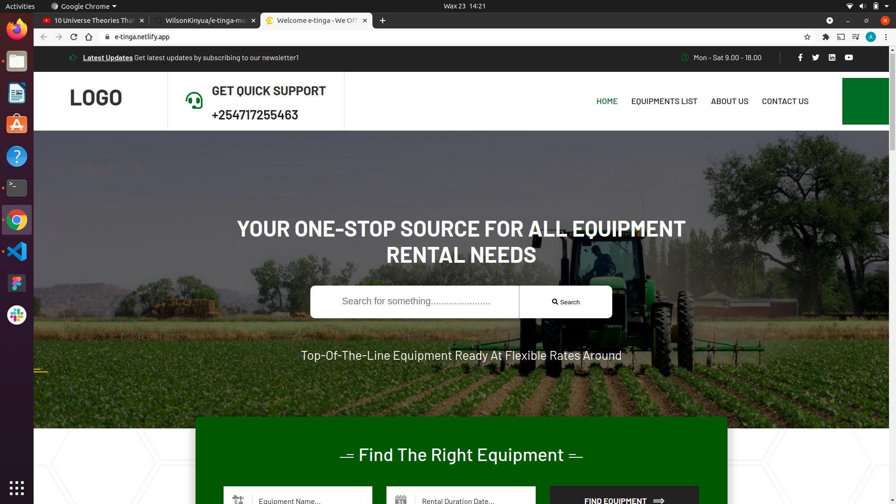
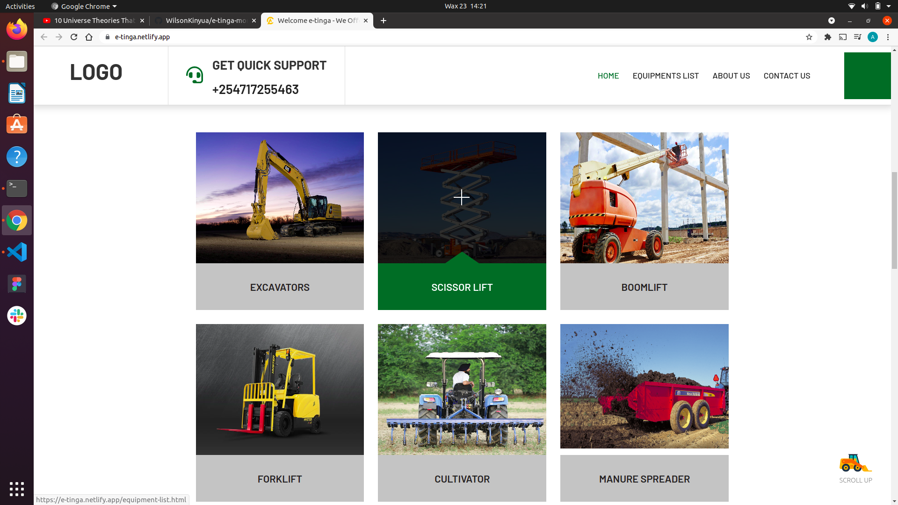
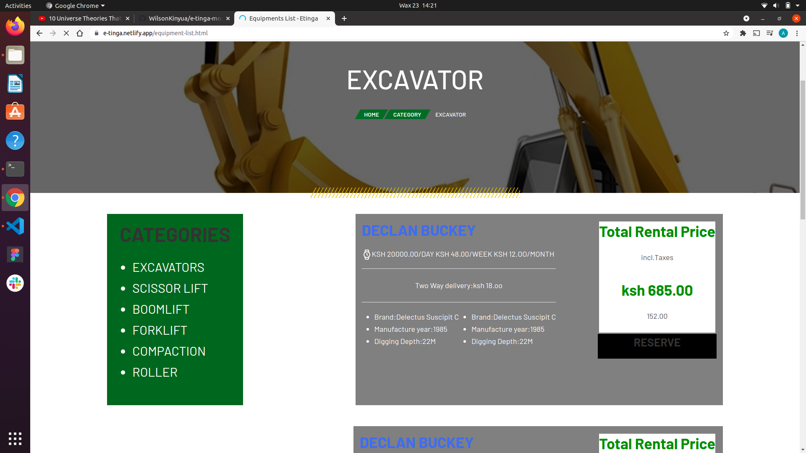
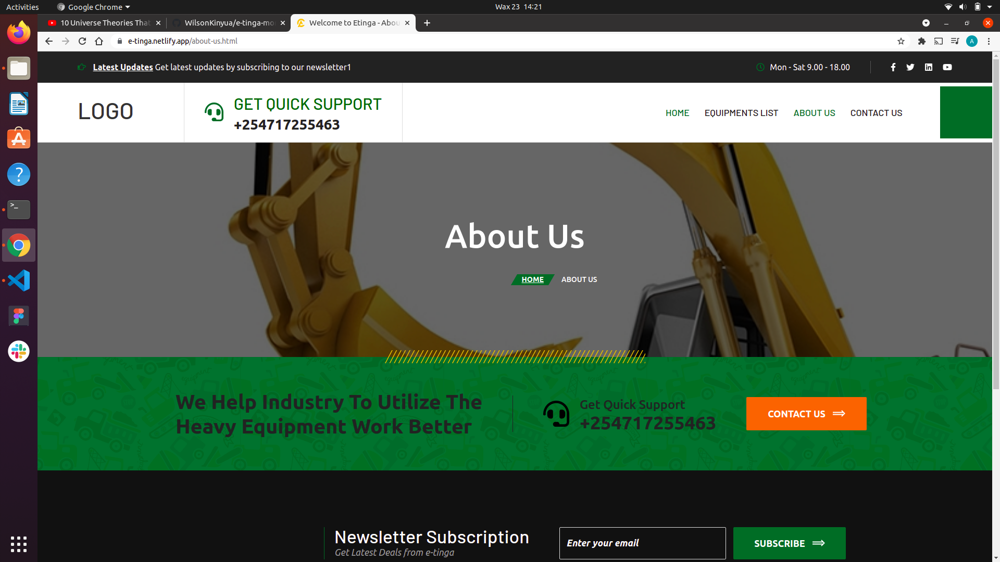
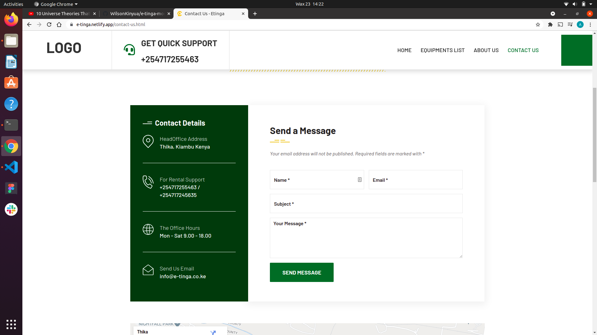

# E-tinga School Project
#### Landing page of E-tinga website
#### Created By Wilson Kinyua Muthoni,Aron Langat,Edwin Kipchumba and Esther Moki on 23-06-2021
## Description
This is a website that enables farmers hire farm equipment they are in need of at their own convenient time
## Setup/Installation Requirements
* Git
* Web-browser or your choice
* Github
## Technologies Used
 The following languages have been used on this project:
 * HTML
 * CSS
 * javascript
## Setup/Installation Requirements

* Live link to view the project <a href="https://e-tinga.netlify.app/">View E-tinga project</a>
## Some images used

## Known Bugs
 So far so good there are no bugs related to this project 😎
## Support and contact details 🙂
To make a contribution to the code used or any suggestions you can click on the contact link and email me your suggestions.
* Email :wilson@developerwilson.com,
        :lankipkoecharo@gmail.com,
        :edwinkolem5@gmail.com,
        :esther.moki@student.moringaschool.com

* Phone : +254717255460
        : +254705378641
        : +254728357619
        : +254713439798
## License
* MIT licence Copyright (c) 2021 Moringa school.