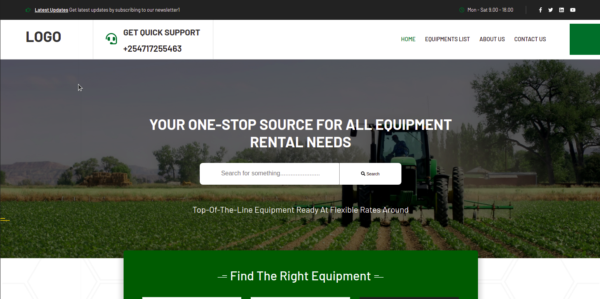
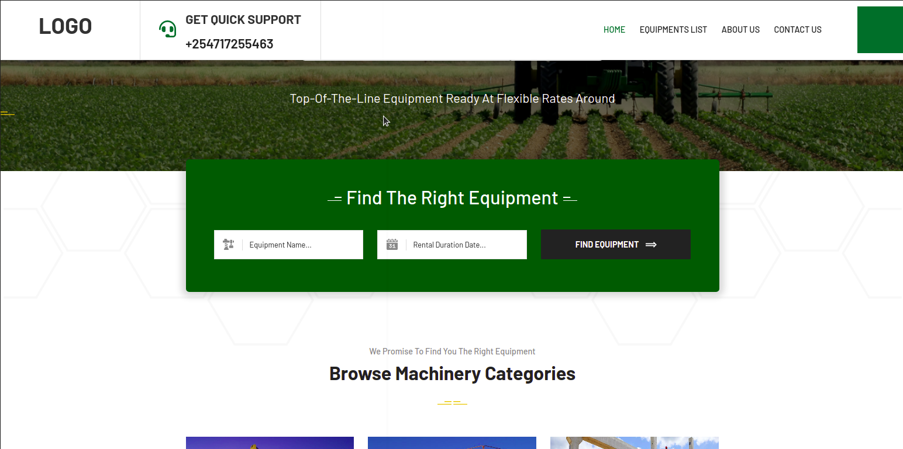
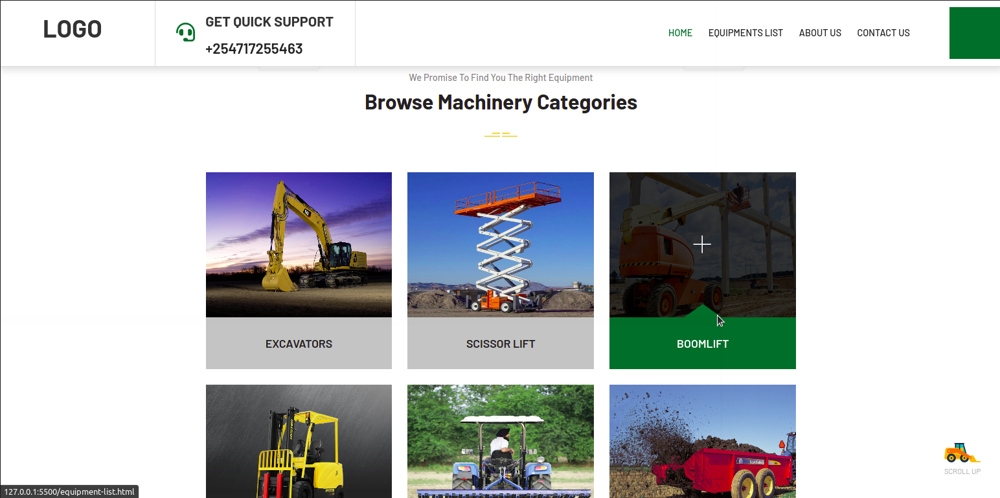
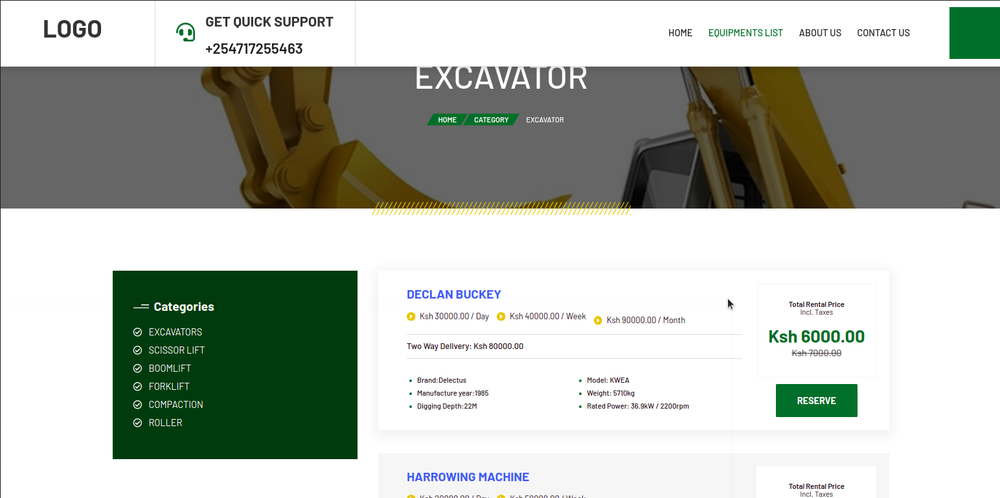
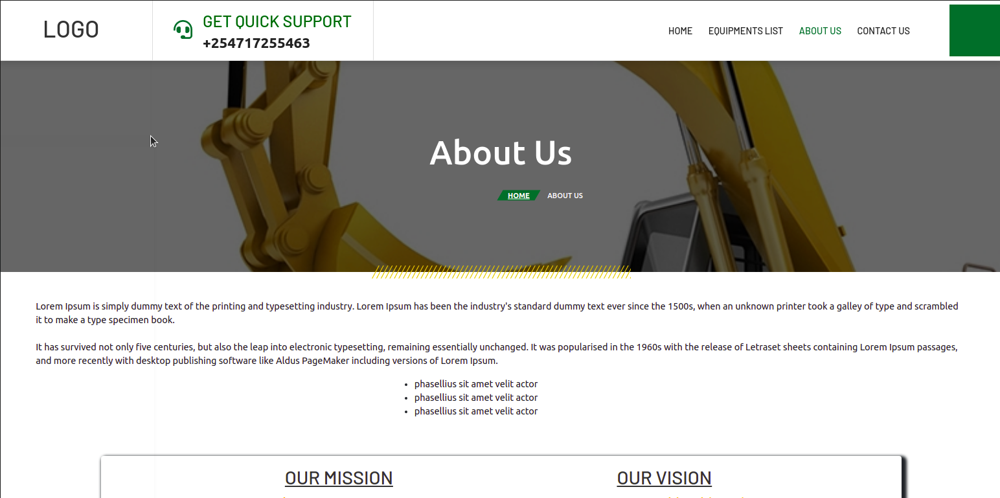
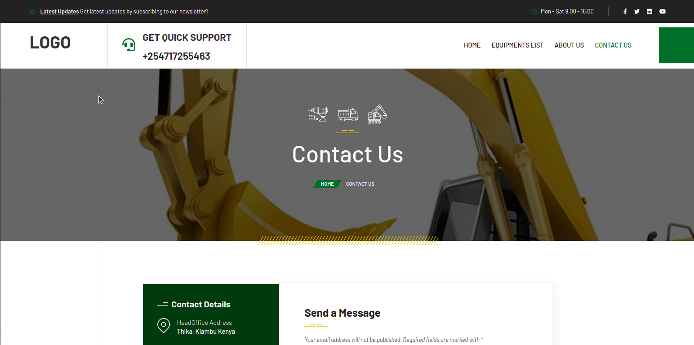
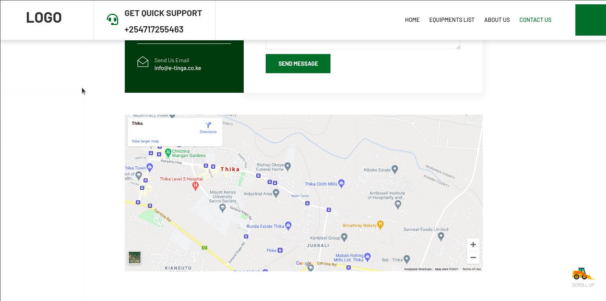

# E-tinga Moringa School Group Project
#### E-tinga website
#### Created By Wilson Kinyua Muthoni,Aron Langat,Edwin Kipchumba and Esther Moki on 21-06-2021
## Description

E-Tinga is a project that employs modern technology channels to allow farmers access farm mechanization. One of these being its online-based platforms that enable farmers to order for services as groups or individuals using hand gadgets such as mobile phones, tablets,s or computers. This accessibility enables even small-scale farmers to enjoy farming equipment on short-term leases. Etinga Community Model Concept works by allowing farmers to register for mechanization services as groups through already established units such as NGOs, Chama, SACCO, Co-operative Societies, or Churches.

## Setup/Installation Requirements 😃
* Git
* Web-browser or your choice
* Github
## Technologies Used
 * The following languages have been used on this project:

 

  
   
 

## Setup/Installation Requirements

* Live link to view the project <a href="https://wilsonkinyua.github.io/e-tinga-moringa-school-project/">View E-tinga project</a>
## Some images used

## Known Bugs
 So far so good there are no bugs related to this project 😎
## Support and contact details 🙂
To make a contribution to the code used or any suggestions you can click on the contact link and email me your suggestions.
* Email :wilson@developerwilson.com,
        :lankipkoecharo@gmail.com,
        :edwinkolem5@gmail.com,
        :esther.moki@student.moringaschool.com

* Phone : +254717255460
        : +254705378641
        : +254728357619
        : +254713439798
## License
* MIT licence Copyright (c) 2021 Moringa school.